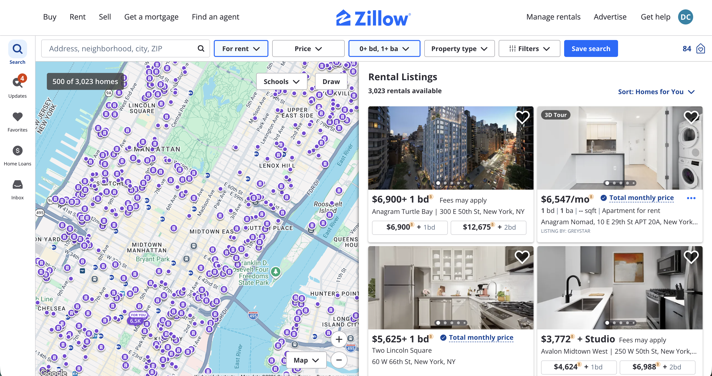

# Home Prices in Bitcoin

A Chromium browser extension that converts housing prices on Zillow to their Bitcoin equivalent. Each price gets a small toggle pill. Click it to flip between USD and BTC, globally across the page.

Not affiliated with Zillow, Inc. or any other listing service.

## Screenshots

Search results, with every rental and sale price converted in place:

Individual listing, with sale price, monthly estimate, and Zestimate all converted:

## Features

- Auto-converts every USD price on Zillow to BTC on page load (no clicking required)
- Per-price toggle badge that flips the whole page between BTC and USD
- Handles rental suffixes like `/mo`, `+ 2 bds`, `+ 1 bd` so the badge sits at the end of the full grouping
- Re-scans on dynamic content (infinite scroll, React re-renders) via MutationObserver
- BTC/USD rate cached 5 minutes via CoinGecko's free API
- Popup shows current rate, last refresh time, and a manual refresh button

## Install (load unpacked)

1. Clone or download this repo
2. Open `chrome://extensions` (or `brave://extensions`, `edge://extensions`)
3. Toggle on **Developer mode** (top right)
4. Click **Load unpacked** and select this folder
5. Visit any Zillow page. Prices will display in BTC with a small `$` pill to toggle back to USD

## How it works

| File | Role |
|------|------|
| `manifest.json` | MV3 manifest, declares content script + service worker + host permissions |
| `background.js` | Service worker. Fetches BTC/USD from CoinGecko, caches 5 min, returns stale cache on network failure |
| `content.js` | Walks Zillow's DOM text nodes, regex-matches USD prices, wraps each in a toggle span. MutationObserver re-scans on DOM changes |
| `content.css` | Styles for the badge pill. Uses `!important` everywhere to win specificity against Zillow's styles |
| `popup.html` / `popup.js` | Toolbar popup with current rate and refresh button |
| `icons/` | 16/32/48/128 PNG icons |

## Permissions

- `https://www.zillow.com/*`, required to inject the content script
- `https://api.coingecko.com/*`, required for the BTC/USD rate
- `storage`, for caching the rate locally

No analytics, no remote code, no PII.

## Limitations

- Only `www.zillow.com` is matched. Mobile (`m.zillow.com`) or regional variants aren't covered.
- Trailing suffixes (`/mo`, `+ N bd(s)`) are only absorbed when they live in the same text node as the price. If Zillow splits them into separate DOM nodes, the badge will land between the price and the suffix.
- Falls back to a hardcoded BTC price if both the live API and cache are unavailable. This will be stale.
- Uses CoinGecko's free unauthenticated tier, which is rate-limited.

## Prior art

Similar extensions exist on the Chrome Web Store: Coincasa, HouseHash, Horizon (Home Values in Bitcoin), and general-purpose converters like bitconverter and ConvertBit. This one is built specifically around the in-page per-price toggle pill UX.

## License

MIT. See [LICENSE](LICENSE).
